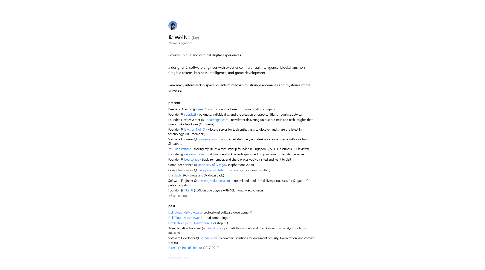
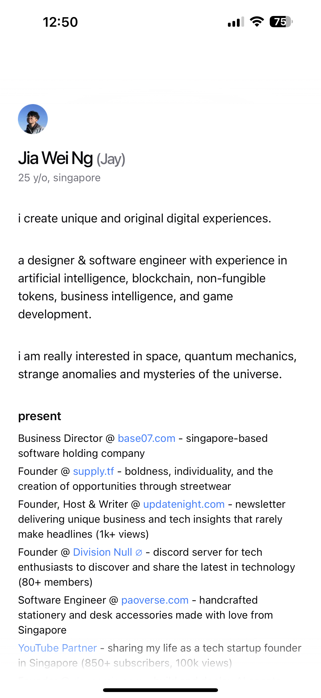

<table width="100%">
  <tr>
    <td align="center" width="120">
      
    </td>
    <td align="right">
      <h1>Portfolio (Codename Dex)</h1>
      <h3 style="margin-top: -10px;">just an ordinary guy who makes software, with unique and original digital experiences.</h3>
    </td>
  </tr>
</table>

<table>
  <tr>
    <td width="50%">
      
      <p align="center"><em>Desktop View</em></p>
    </td>
    <td width="50%">
      
      <p align="center"><em>Mobile View</em></p>
    </td>
  </tr>
</table>

### Local Development

1. Clone the repository

   ```bash
   git clone https://github.com/jiaweing/portfolio-dex.git
   cd portfolio-dex
   ```

2. Install dependencies

   ```bash
   bun install
   ```

3. Start the development server

   ```bash
   bun dev
   ```
