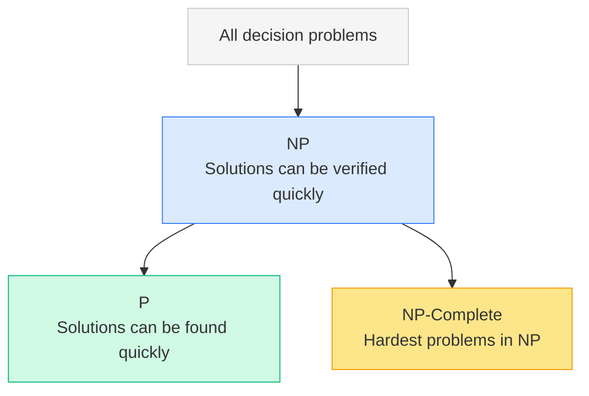
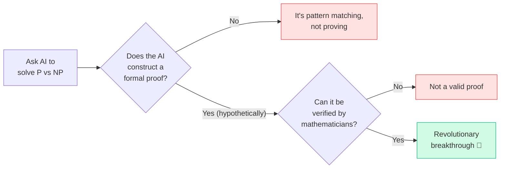
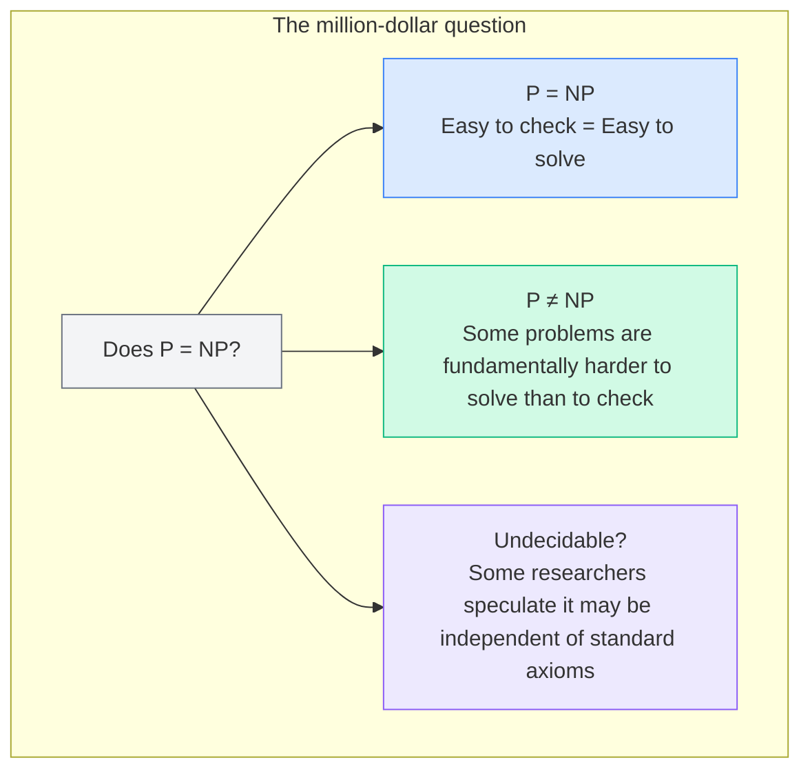

Every computer scientist has a white whale. For the entire field of theoretical computer science, that white whale is a single, deceptively simple question: **if you can check an answer quickly, can you also find that answer quickly?** This is the P vs NP problem, and it has remained unsolved for over 50 years. It carries a \$1,000,000 bounty from the Clay Mathematics Institute, and its resolution would reshape cryptography, artificial intelligence, medicine, and mathematics itself.
Let's break it down from scratch, no PhD required.
## What "solving" and "checking" really mean
Before diving into P and NP, we need to understand what computer scientists mean by **easy** and **hard**. They don't mean how much effort it takes a human. They mean how the time a computer needs grows as the problem gets bigger.
Imagine sorting a list of names alphabetically. With 10 names, it's fast. With 10,000 names, it takes longer, but not outrageously so. The time grows at a manageable, *polynomial* rate (think $`n^2`$ or \$n log n\$). Computer scientists call this **polynomial time**, and it's their definition of "efficiently solvable."
Now imagine trying every possible arrangement of cities to find the shortest road trip. With 5 cities, there are 120 possible routes. With 20 cities, there are over 2 quintillion. The time doesn't just grow, it **explodes** exponentially. That's the kind of problem that makes computers sweat.
## The two classes: P and NP

**P** stands for **Polynomial time**. These are problems a computer can *solve* efficiently.
**NP** stands for **Nondeterministic Polynomial time**. These are problems where, if someone hands you a proposed answer, you can *verify* it efficiently.
Here's the critical insight: **every P problem is also in NP**. If you can solve something quickly, you can certainly check it quickly too. But the reverse, can every problem that's easy to check also be easy to solve, is the million-dollar question.
<table fit-page-width="true" header-row="true">
<tr color="blue_bg">
<td>**Class**</td>
<td>**What it means**</td>
<td>**Example**</td>
</tr>
<tr>
<td>**P**</td>
<td>Can be *solved* in polynomial time</td>
<td>Sorting a list, finding the shortest path in a GPS</td>
</tr>
<tr>
<td>**NP**</td>
<td>A proposed solution can be *verified* in polynomial time</td>
<td>Sudoku: hard to solve, easy to check if a completed grid is correct</td>
</tr>
<tr>
<td>**NP-Complete**</td>
<td>The hardest problems in NP, every NP problem can be transformed into one of these</td>
<td>The Travelling Salesman Problem, Boolean Satisfiability (SAT)</td>
</tr>
<tr>
<td>**NP-Hard**</td>
<td>At least as hard as NP-Complete, but solutions may not even be verifiable quickly</td>
<td>The Halting Problem</td>
</tr>
</table>
## A real-world analogy: the jigsaw puzzle
Think of a massive jigsaw puzzle with a million pieces.
- **Checking** a completed puzzle is easy. You look at it and confirm every piece fits. That's polynomial time verification, so the problem is in **NP**.
- **Solving** the puzzle from a pile of loose pieces? Nobody knows a shortcut. You might have to try an astronomical number of combinations. If no polynomial-time method exists for solving it, then the problem is in **NP but not in P**.
The P vs NP question is simply: **does a clever shortcut always exist, even if we haven't found it yet?**
## What is a proof, and why does it matter here?
In mathematics, a **proof** is a chain of logical steps that starts from accepted truths (axioms) and arrives at a conclusion with absolute certainty. It's not a simulation, not a strong hunch, and not a statistical argument. It's airtight.
To resolve P vs NP, you'd need to either:
1. **Prove P = NP**: show that every problem whose solution can be checked quickly can also be *solved* quickly. This would require producing a polynomial-time algorithm for an NP-Complete problem (since all NP problems reduce to NP-Complete ones).
2. **Prove P ≠ NP**: show that no such algorithm can possibly exist for at least one NP problem. This requires proving a *negative*, which is notoriously difficult because you're not just saying "we haven't found it yet," you're saying "it's impossible."
This is what makes the problem so hard. Most computer scientists believe P ≠ NP (in a famous 2002 poll, 61 out of 70 researchers held this view), but belief is not proof.
## Why hasn't anyone solved it?
The core difficulty lies in the nature of the proof itself.
### Proving P = NP would require a breakthrough algorithm
To show that P = NP, someone would need to find an efficient algorithm for any NP-Complete problem. Despite decades of effort by the brightest minds in computer science, no such algorithm has ever been found for problems like the Travelling Salesman Problem, Boolean Satisfiability, or graph colouring.
### Proving P ≠ NP means proving impossibility
This is even harder. You'd need to show that among the *infinite* number of possible algorithms, not a single one could solve an NP-Complete problem efficiently. Several promising proof techniques have been tried and have hit fundamental barriers:
<table fit-page-width="true" header-row="true">
<tr color="orange_bg">
<td>**Proof technique**</td>
<td>**Why it failed**</td>
</tr>
<tr>
<td>Diagonalization</td>
<td>Can separate some complexity classes, but Baker, Gill, and Solovay (1975) showed it cannot resolve P vs NP because it "relativizes," meaning it gives contradictory results depending on the oracle used</td>
</tr>
<tr>
<td>Circuit complexity</td>
<td>Early successes in proving lower bounds for restricted circuit models, but progress stalled for unrestricted circuits</td>
</tr>
<tr>
<td>Natural proofs</td>
<td>Razborov and Rudich (1997) showed that a broad class of proof strategies ("natural proofs") cannot work if certain cryptographic assumptions hold</td>
</tr>
<tr>
<td>Algebrization</td>
<td>Aaronson and Wigderson (2009) extended the relativization barrier, showing that even algebraic techniques hit a wall</td>
</tr>
</table>
Every major approach has run into a brick wall. The problem seems to demand a fundamentally new kind of mathematical reasoning.
## Can AI solve it?
This is a natural question in the age of ChatGPT, Claude, and other large language models. The short answer: **no, and here's why.**
Large language models work by predicting the next most likely token based on patterns in training data. They are incredibly good at summarizing, explaining, and even writing code. But they don't *reason* in the mathematical sense. They don't construct proofs from axioms, and they don't explore novel mathematical structures.
You can ask ChatGPT or Claude to "prove P = NP" and you'll get something that *looks* plausible, but it will contain logical gaps, circular reasoning, or outright errors. These models are sophisticated pattern matchers, not theorem provers.
That said, AI *is* being used as a tool to assist mathematicians. Projects like DeepMind's AlphaProof and Meta's formal verification tools can help check proofs and explore candidate approaches. But generating the core insight needed to resolve P vs NP? That remains a deeply human (or perhaps superhuman) challenge.

## What would happen if someone solved it?
The consequences would be staggering, regardless of which way the answer goes.
### If P = NP
- **Cryptography collapses.** Most encryption (RSA, elliptic curve) relies on the assumption that certain problems (like factoring large numbers) are hard to solve but easy to verify. If P = NP, efficient algorithms would exist to break virtually all current encryption.
- **Drug discovery accelerates.** Protein folding, molecular simulation, and other combinatorial biology problems could be solved efficiently.
- **Optimization transforms.** Logistics, scheduling, resource allocation, basically every hard optimization problem in industry would become tractable.
- **Mathematics itself changes.** Finding proofs would become as easy as checking them, meaning computers could, in theory, prove any provable theorem efficiently.
### If P ≠ NP (the widely expected answer)
- **Cryptography is on solid ground.** We'd have formal assurance that certain problems are fundamentally hard, giving encryption a mathematical foundation rather than just "nobody's broken it yet."
- **Hard problems stay hard.** We'd know for certain that some problems simply cannot be solved efficiently, guiding researchers to focus on approximation algorithms and heuristics instead.
## The big picture

P vs NP is one of those rare questions that is simple to state but seems to resist every attempt at resolution. It sits at the intersection of mathematics, philosophy, and computer science, touching on deep questions about the nature of creativity, proof, and computation itself.
For now, the puzzle remains open. And that, in a strange way, is what makes it beautiful. The fact that we can pose a question so simple that a child could understand it, yet so deep that the collective intellect of humanity hasn't cracked it, tells us something profound about the limits of knowledge.
If you ever solve it, there's a million dollars and a permanent place in history waiting for you.
## References
1. Cook, S. (1971). "The Complexity of Theorem-Proving Procedures." *Proceedings of the Third Annual ACM Symposium on Theory of Computing*. [https://dl.acm.org/doi/10.1145/800157.805047](https://dl.acm.org/doi/10.1145/800157.805047)
2. Clay Mathematics Institute. "P vs NP Problem." [https://www.claymath.org/millennium-problems/p-vs-np-problem](https://www.claymath.org/millennium-problems/p-vs-np-problem)
3. Baker, T., Gill, J., Solovay, R. (1975). "Relativizations of the P =? NP Question." *SIAM Journal on Computing*, 4(4), 431–442.
4. Razborov, A., Rudich, S. (1997). "Natural Proofs." *Journal of Computer and System Sciences*, 55(1), 24–35.
5. Aaronson, S., Wigderson, A. (2009). "Algebrization: A New Barrier in Complexity Theory." *ACM Transactions on Computation Theory*, 1(1), 1–54.
6. Gasarch, W. (2002). "The P=?NP Poll." *SIGACT News*, 33(2), 34–47.
7. MIT News. "Explained: P vs. NP." [https://news.mit.edu/2009/explainer-pnp](https://news.mit.edu/2009/explainer-pnp)
8. Fortnow, L. (2021). "Fifty Years of P vs. NP and the Possibility of the Impossible." *Communications of the ACM*, 64(1).
